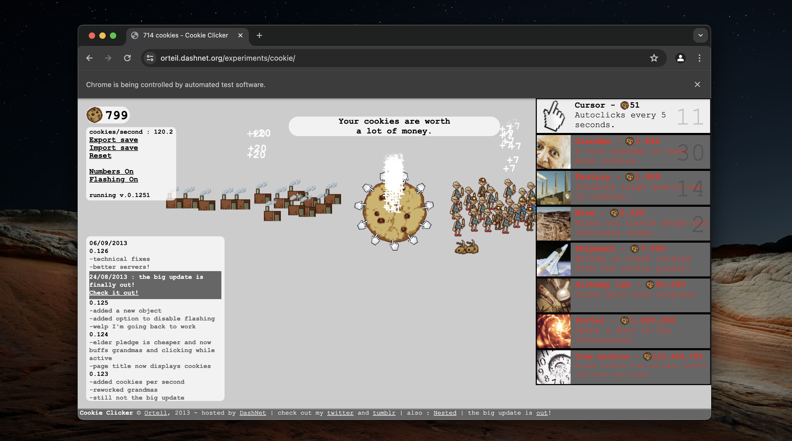

# Cookie Clicker Bot

A simple Selenium-based bot to automate the Cookie Clicker game, enhancing cookie production by clicking the cookie and purchasing upgrades.

## Requirements

    • Python 3.x
    • Selenium
    • Chrome browser

## How It Works

The bot continuously clicks the cookie and automatically buys the best available upgrades to boost cookie production.

## Gameplay

The bot launches Cookie Clicker in a Chrome browser and plays for 5 minutes.

## Visuals

